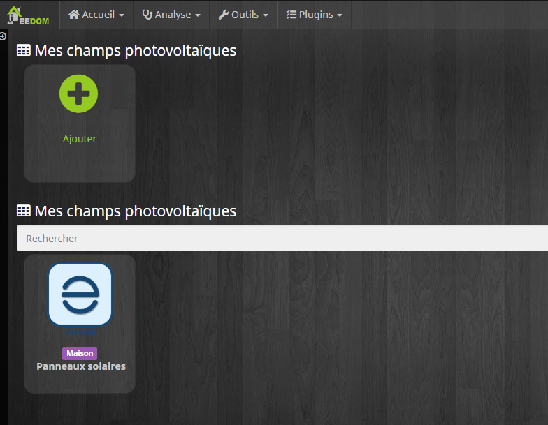

Présentation
============

Le plugin Enphase permet de connecter Jeedom à la passerelle Enphase permettant de recueillir les données de production des panneaux solaires Enphase.

Configuration
=============

Installez le plugin et activez-le.

Ensuite, allez sur la page de configuration du plugin afin d'y ajouter un équipement.

> **NOTE**
>
> Ici, j'ai déjà créé un équipement.

Création d'un équipement
========================

Renseignez les données habituelles (nom, parent, ...). Ensuite, saisissez l'adresse IP **locale** de la passerelle Enphase, l'identifiant et le mot de passe.

Commandes
=========

Ce plugin nous offre trois informations. La production instantanée, la production journalière et la production cumulée (depuis la mise en route de l'instalation photovoltaïque).

